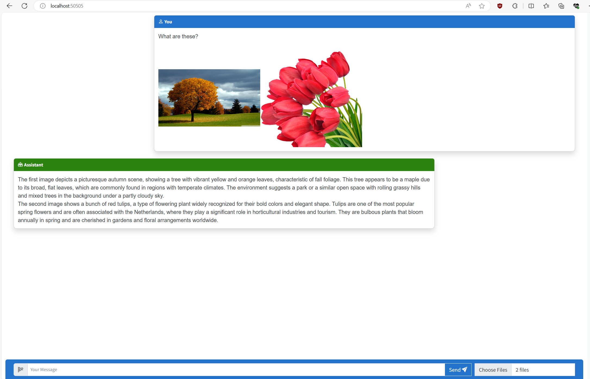

# Sample Application using Azure OpenAI Assistants with Image Input Support (Python)

This sample includes a simple Python [Quart](https://quart.palletsprojects.com/en/latest/) app that streams responses from OpenAI Assistant to an HTML/JS frontend using Server-Sent Events (SSEs). The application supports both image (.jpg/jpeg, .webp, .gif, .png) and text inputs.

The sample is designed for use with [Docker containers](https://www.docker.com/), both for local development and Azure deployment. For Azure deployment to [Azure Container Apps](https://learn.microsoft.com/azure/container-apps/overview), please use this [template](https://github.com/Azure-Samples/openai-chat-app-quickstart) and replace the `src` folder content with this application.

## Local development with Docker

This sample includes a `docker-compose.yaml` for local development which creates a volume for the app code. That allows you to make changes to the code and see them instantly.

1. Install [Docker Desktop](https://www.docker.com/products/docker-desktop/). If you opened this inside Github Codespaces or a Dev Container in VS Code, installation is not needed. ⚠️ If you're on an Apple M1/M2, you won't be able to run `docker` commands inside a Dev Container; either use Codespaces or do not open the Dev Container.

2. Make sure that the `.env` file exists.

3. Store keys and endpoint information (Azure) for the OpenAI resource in the `.env` file. The key should be stored in the `.env` file as `AZURE_OPENAI_API_KEY or OPENAI_API_KEY`. This is necessary because Docker containers don't have access to your user Azure credentials.

4. Start the services with this command:

    ```shell
    docker-compose up --build
    ```

5. Click 'http://localhost:50505' in the browser to run the application.

## Example run



## Deployment to Azure

As mentioned earlier, please integrate this app using [template](https://github.com/Azure-Samples/openai-chat-app-quickstart) and following the Azure Container App deployment steps there.